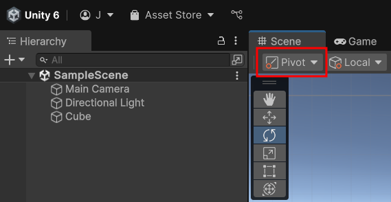
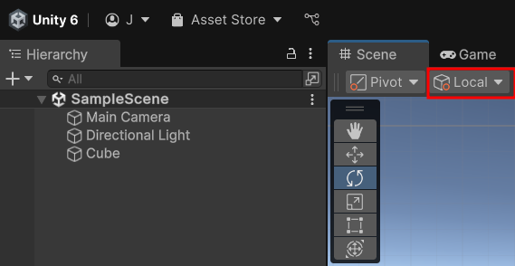

# Introduction to Metaverse 
### Week2 : Introduction to Unity

## Recap

Unity Editor 환경설정

Windows

1. Scene
2. Hierarchy
3. Project
4. Game
5. Inspector
6. Console

Unity는 왼손 좌표계를 사용

→ User Interface를 잘 표현할 수 있음

Camera는 z방향을 바라봄

x: Red, y:Green,  z:Blue

### RigidBody

- Object에 물리 기능을 추가하는 컴포넌트
- ex) 중력

### Corrider

- Object가 실제 면을 가지고 있는 것은 아님
- 시각적으로 표현하기 위해 Cube 모양인 것

## Unity Editor Interface

### 기즈모

- 게임과 관계없는 가이드, 툴
- 씬 기즈모
    - 우측 상단의 xyz축 원뿔
    - 씬 카메라의 방향과 시점을 파악 및 변경
    - 원근투영과 직교투영 전환

## 간단한 그래픽스 이해

### 장면(Scene)

- 3D Object들이 놓여질 작은 공간
- Game Object == Object

Renderer

- Main camera의 시점을 모니터에 나타내기 위해 현상, Encoding

Scene

- Scene에 Object들이 있고, Object들은 Mesh Renderer를 통해 Mesh가 그려짐
- Camera가 Scene을 바라봄

Mesh Renderer

- Object의 Mesh를 그리는 Component

Scene Graph

- Object들이 Tree 구조로 구성되어 있음

Mesh

- 눈에 보이는 Object의 기하

### 좌표계(공간)

- 원점과 방향
- 왼손 좌표계
- 현상지는 Lens 바로 앞에 붙어있음
- 좌표계 변환은 하나의 공간에서 다른 공간으로 이동한다는 의미
- 오브젝트 공간 → 글로벌 공간 → 뷰포트 공간(카메라) → 스크린 공간

### 좌표계의 종류

1. 오브젝트 좌표계
- 오브젝트(모델) 자신이 갖고 있는 좌표계
- 오브젝트의 기하(Geometry)를 정의할 때 기준으로 삼은 좌표계
- 모델 좌표계라고도 함
- 글로벌 좌표계 관점에서 봤을 때는 로컬좌표계
1. 글로벌 좌표계
- 오브젝트들이 놓여질 때 기준이 되는 글로벌 공간의 좌표계
- 부모-자식 관계의 두 오브젝트가 있을 때, 부모의 좌표계를 좁은 개념의 글로벌 좌표계 또는 기준 좌표계라고도 함
1. 로컬 좌표계
- 
1. 카메라 좌표계
- 렌즈 원점 기준으로 절두체(Frustum) 형상의 공간 내 정의
- 직교투영/원근투영에 따라 왜곡된 형태
- 뷰포트 공간이라고도 함
1. 스크린 좌표계

### 카메라

- 게임 월드 공간을 주시하는 pin-hole 망원경
- 눈으로 바라보는 세상

### 트랜스폼 툴바

1. 핸드 툴: `Q` 씬 탐색
2. 평행 이동 툴: `W` 오브젝트 평행 이동
3. 회전 툴: `E` 오브젝트 회전
4. 스케일 툴: `R` 오브젝트 크기 조정
5. 렉트 툴: `T` 2D UI에서 주로 사용
6. 트랜스폼 툴: `Y` 평행이동, 회전, 스케일을 동시에 적용

### 피벗-센터, 로컬-글로벌

**Pivot/Center**



1. Pivot
- 실제 오브젝트의 위치를 기준으로 오브젝트 위에 씬 도구를 표시
1. Center
- 실제 오브젝트 로컬 좌표계 위치와는 상관없이 오브젝트의 정중앙에 씬 도구들이 표시

**Local/Global**



1. Local
- 게임 오브젝트 자신이 가지고 있는 기준 좌표계(로컬)를 기준으로 이동
1. Global
- 게임 오브젝트가 가진 기준 좌표계가 아닌, 씬 창에 기즈모로 표시된 글로벌 좌표계를 기준으로 이동, 회전, 스케일

### 프로젝트 폴더 구조와 프로젝트 다시 열기

- Unity Project의 필수 폴더는 `Assets` , `Packages` , `ProjectSettings`
- 나머지는 삭제해도 됨
- Project 전달을 위해 이 3가지만 전달하면 됨

## 게임 엔진의 원리

### 게임 엔진 및 라이브러리

- High-level game engine
- Midium-level visualization
- Low-level rasterization

### Object와 Component

- GameObject
    - 빈 껍데기 Object
    - Component들을 수용하는  Holder
- Component

### Game Engine을 사용하는 이유

- Game engine은 low-level을 감싸는 이미 완성된 기반 코드를 제공: API, Component
- 이미 구현되어 제공되는 기능들을 재사용

### 상속

- Component는 재사용과 상속 개념과 밀접
- 이미 만들어진 Base Class를 기반으로 파생 Class(Derived Class)에서 자신만의 새로운 기능을 덧붙이는 방법
- ex) Monster Class → Orc Class → OrcChieftan Class
- 항상 잘 동작하는 것은 아님
    - 완벽하게 순수한 Base Class를 만드는 것은 힘듦
    - 파생 클래스가 필요하지 않는 기능도 물려줄 수 있음
    - Base Class의 장점과 단점 모두 상속받아야 함
    - 상속에만 의지하면 코드를 재사용하기 힘듦
    - 상속 대신 Composition을 사용, **Game Object-Component**

### Component

- Game Object에 붙일 수 있는 미리 만들어진, 재사용 가능한 기능 단위의 부품
- 스스로 동작하는 독립적 부품
    - Component들은 서로 독립적
    - Game Object에 붙어있어야 동작 가능
- 컴포넌트의 장점
1. 유연한 재사용: 각각의 독립적 기능을 붙이며 완성
2. 게임 기획자가 프로그래머에 대한 의존도 낮출 수 있음
3. 컴포넌트의 독립성 덕분에 추가와 삭제가 쉬움

### Game Object와 Component 정리

- Component는 타 Component에 관심 없음
- 모든 Game Object는 Transform Component를 필수적으로 가지고 있음
    - 글로벌 좌표계를 기준으로 위치를 정의
- Game Object 생성 시 Default로 붙어있는 Component
    - Mesh Filter: 기하 형상 지정
    - Mesh Renderer: Mesh 외곽선 따라 그래픽 표현
    - Box Colider: 물리적 표면을 생성, 충돌을 인식, 없으면 다른 물체가 이 Object를 뚫고 지나감

### C# Script도 Component임

- 게임 오브젝트에 컴포넌트 형태로 붙어 프로그래머의 의도에 따라 해당 오브젝트가 지정된 기능 또는 동작을 수행하도록 지시하는 C# 코드 파일
- C# 스크립트 작성시 이미 유니티 내에 내장되어 있는 컴포넌트 객체들을 생성하거나 끌고와서 그 컴포넌트의 기능들을 사용 가능

```csharp
public Rigidbody myRigidbody; // myRigidbody 라는 참조변수로 이미 생성해 놓은 Rigidbody 컴포넌트를 가져와 사용할 수 있다.

void Start()
{ 
myRigidbody.AddForce(0, 500, 0); // Rigidbody 컴포넌트에선 AddForce라는 메소드를 제공한다. x, y, z 축 방향으로 오브젝트에 힘을 주는 기능.
}

void Update()
{

}
```

- Inspector 창에 추가된 스크립트에 가보면, 위와 같은 컴포넌트를 붙여주는 창이 열림 여기에 Rigidbody 컴포넌트를 드레그 앤 드롭해 줌
- 이렇게 하면 참조변수인 myRigidbody를 통해 Rigidbody 컴포넌트에 접근할 수 있음. 이를 통해 스크립트에서 Rigidbody 컴포넌트의 기능을 동작시킬 수 있음
- 어려운 물리학 지식을 알고 이를 구현하는 수고를 감수해야할 필요가 없이, 그냥 미리 구현되어 있는 컴포넌트를 붙이기만 하면 됨


